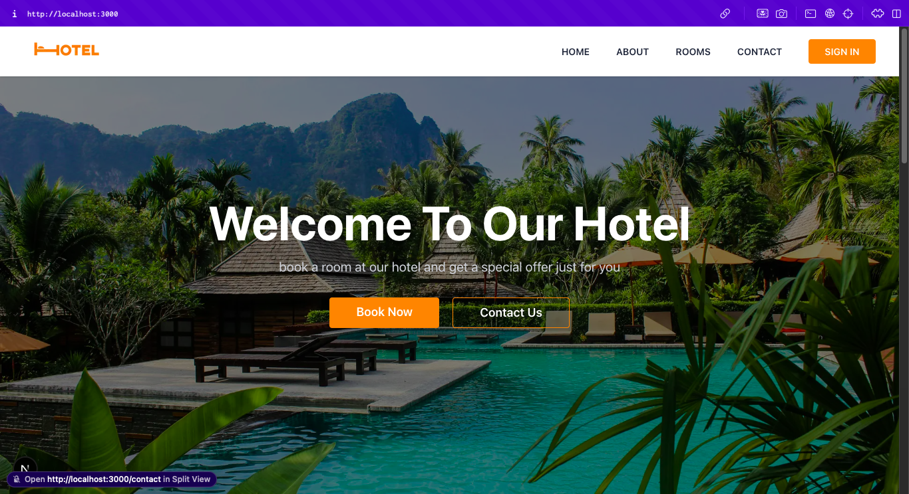

# Hotel Booking Web App with Next.js ✨



> A simple learning project built with **Next.js**, designed to explore and understand core features of the framework, including routing, API routes, and static generation.

## 🚀 Features

- ✅ Next.js Routing (Pages & App Router)
- ✅ Static Generation (SSG) & Server-side Rendering (SSR)
- ✅ API Routes
- ✅ Dynamic Routing
- ✅ Basic Layout & Styling with CSS Modules
- ✅ Client-side Navigation

## 📁 Folder Structure

```
next-learn/
├── pages/
│   ├── index.js
│   ├── about.js
│   └── ...
├── public/
│   └── screenshot.png
├── styles/
│   └── globals.css
├── package.json
└── README.md
```

## 🛠️ Tech Stack

- [Next.js](https://nextjs.org/)
- [React](https://reactjs.org/)
- [TypeScript](https://www.typescriptlang.org/)
- [Prisma](https://www.prisma.io/)
- [Tailwind CSS](https://tailwindcss.com/)
- [Vercel](https://vercel.com/)
- [PostgreSQL](https://www.postgresql.org/)
- [Node.js](https://nodejs.org/en/)

## 📦 Installation

```bash
# Clone the repo
git clone https://github.com/ruspian/next-learn.git

# Install dependencies
cd next-learn
npm install

# Start the development server
npm run dev
```

Buka di browser:

```
http://localhost:3000
```

## Contributing

Jika anda ingin mengembangkan Next Learn, silahkan kontribusi di [Github](https://github.com/ruspian/next-learn)
silahkan pull request ke [Github](https://github.com/ruspian/next-learn)
bantuan dan dukungan anda sangat saya butuhkan ;)

## 📄 License

MIT © [Ruspian Majid](https://github.com/ruspian)
